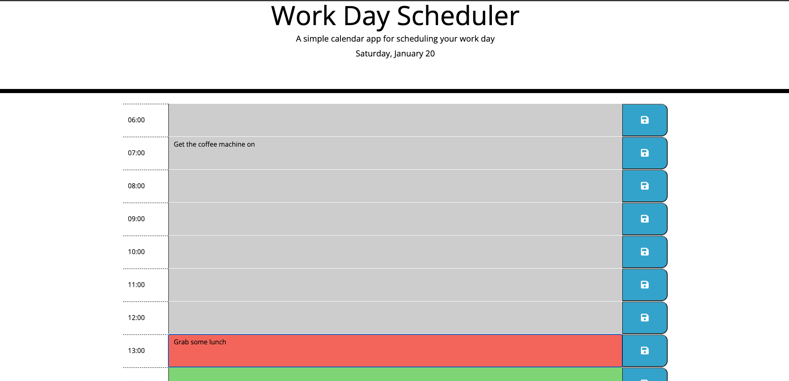
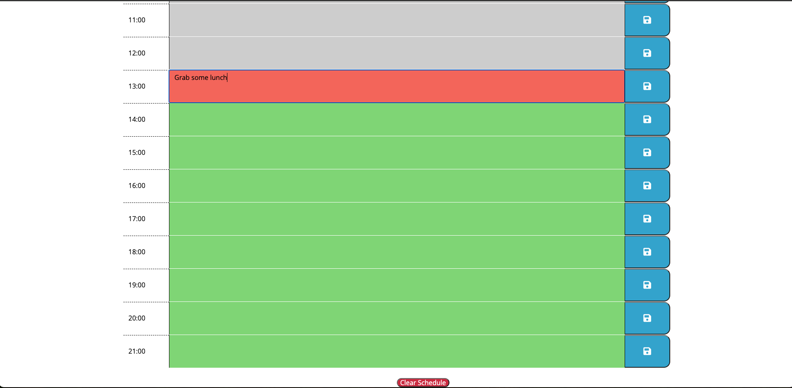

# Work Day Scheduler

This is a simple schedual application that allows a user to save events for each hour of the day. 

* The user is able to input an entry and save with the button on the right side.
* This enteries are stored to localStorage and will persist if the page is refreshed. 
* There is a clear schedual button at the bottom of the schedual.

This app will run in the browser and feature dynamically updated HTML and CSS powered by jQuery and time powered by days.js.

The Top half of the schedual page
<figure>
  
</figure>
Bottom of the schedual page
<figure>
  
</figure>

## Getting Started

* Clone the repository
* Open the index.html file in your browser.

or you can view a deployed version here: https://timeades.github.io/Work_Day_Schedular/

